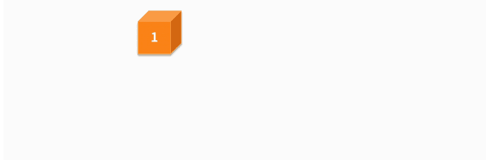

# 复杂度：如何衡量程序运行的效率？


在大数据环境中开发代码时，你一定遇到过程序执行好几个小时、甚至好几天的情况，或者是执行过程中电脑几乎死机的情况：

- 如果这个效率低下的系统是 **离线** 的，那么它会让我们的开发周期、测试周期变得很长。
- 如果这个效率低下的系统是 **在线** 的，那么它随时具有时间爆炸或者内存爆炸的可能性。

因此，衡量代码的运行效率对于一个工程师而言，是一项非常重要的基本功。

## 复杂度是什么

> **复杂度 是 衡量 代码运行效率 的重要的 度量因素。**

先看一下 *复杂度* 和 计算机实际任务处理效率 的关系，从而了解降低复杂度的必要性。

> 计算机通过一个个程序去执行计算任务，也就是对输入数据进行加工处理，并最终得到结果的过程。
>
> - 每个程序都是由代码构成的。
>
>   可见，编写代码的核心就是要完成计算。
>
> - 但对于同一个计算任务，不同计算方法得到结果的过程复杂程度是不一样的，这对你实际的任务处理效率就有了非常大的影响。

提到降低复杂度，我们首先需要知道怎么衡量复杂度。在实际衡量时，我们通常会围绕以下2 个维度进行：

- **首先，这段代码消耗的资源是什么。**

  一般而言，代码执行过程中会消耗 计算时间 和 计算空间，那需要衡量的就是 *时间复杂度* 和 *空间复杂度*。

  >举一个实际生活中的例子。某个十字路口没有建立立交桥时，所有车辆通过红绿灯分批次行驶通过。当大量汽车同时过路口的时候，就会分别消耗大家的时间。但建了立交桥之后，所有车辆都可以同时通过了，因为立交桥的存在，等于是消耗了 *空间资源*，来换取了 *时间资源*。

- **其次，这段代码对于资源的消耗是多少。**

  我们不会关注这段代码对于资源消耗的 绝对量，因为不管是 时间 还是 空间，它们的 消耗程度 都与输入的 数据量 高度相关 —— 输入数据少时消耗自然就少。

  为了更客观地衡量消耗程度，我们通常会关注 *时间 或者 空间消耗量* 与 *输入数据量* 之间的关系。

> 那应该如何去计算复杂度呢？

**复杂度是一个关于输入数据量 n 的函数。**

假设你的代码复杂度是 `f(n)`，那么就用个大写字母 O 和括号，把 `f(n)` 括起来就可以了，即 `O(f(n))`。

例如：

- `O(n)` 表示的是，复杂度 与 计算实例的个数 n 线性相关；
- `O(logn)` 表示的是，复杂度 与 计算实例的个数 n 对数相关。

通常，复杂度的计算方法遵循以下几个原则：

- **首先，复杂度与具体的常系数无关**，例如 `O(n)` 和 `O(2n)` 表示的是同样的复杂度。

  > `O(2n)` 等于 `O(n+n)`，也等于 `O(n) + O(n)`。也就是说，一段 `O(n)` 复杂度的代码只是先后执行两遍 O(n)，其复杂度是一致的。

- **其次，多项式级的复杂度相加的时候，选择高者作为结果**，例如 `O(n²) + O(n)` 和 `O(n²)`表示的是同样的复杂度。

  >`O(n²) + O(n) = O(n²+n)`。随着 n 越来越大，二阶多项式的变化率是要比一阶多项式更大的。因此，只需要通过更大变化率的二阶多项式来表征复杂度就可以了。

值得一提的是，**`O(1)` 也是表示一个特殊复杂度**，含义为某个任务通过有限可数的资源即可完成。此处有限可数的具体意义是，**与输入数据量 n 无关**。

> 例如：
>
> - 你的代码处理 10 条数据需要消耗 5 个单位的时间资源，3 个单位的空间资源。
> - 处理 1000 条数据，还是只需要消耗 5 个单位的时间资源，3 个单位的空间资源。
>
> 那么就能发现资源消耗与输入数据量无关，就是 `O(1)` 的复杂度。

来看一个代码任务：对于输入的数组，输出与之逆序的数组。例如，输入 a=[1, 2, 3, 4, 5]，输出 [5, 4, 3, 2, 1]。

- **方法一**，建立并初始化数组 b，得到一个与输入数组等长的全零数组。通过一个 for 循环，从左到右将 a 数组的元素，从右到左地赋值到 b 数组中，最后输出数组 b 得到结果。

  ```python
  a = [1,2,3,4,5]
  b = []
  for i in range(len(a)):
    b.append(0)
  for i in range(len(a)):
    b[len(a)-i-1] = a[i]
  print b
  ```

  - 输入数据是 a；
  - 数据量等于数组 a 的长度；
  - 两个 for 循环，作用分别是给 b 数组 初始化 和 赋值，执行次数 与 输入数据量 相等。

  代码的 **时间复杂度** 就是 `O(n) + O(n)`，也就是 `O(n)`。

  空间方面主要体现在计算过程中，对于存储资源的消耗情况。上面这段代码中，我们定义了一个新的数组 b，它与输入数组 a 的长度相等。因此，**空间复杂度就是 O(n)**。

- **方法二**，定义缓存变量 tmp，通过一个 for 循环，从 0 遍历到 a 数组长度的一半，即：`len(a) / 2`。每次遍历交换首尾对应的元素。最后打印数组 a，得到结果。

   

  ```python
  a = [1,2,3,4,5]
  tmp = 0
  
  for i in range(len(a)/2):
    tmp = a[i]
    a[i] = a[len(a)-i-1]
    a[len(a)-i-1] = tmp
  print a
  ```

  - **时间方面**

    包含一个 for 循环，执行次数是数组长度的一半，时间复杂度变成了 `O(n / 2)`。根据复杂度与具体的常系数无关的性质，这段代码的时间复杂度也是 `O(n)`。

  - **空间方面**

    定义了一个 tmp 变量，它与数组长度无关。也就是说：

    - 输入是 5 个元素的数组，需要一个 tmp 变量；
    - 输入是 50 个元素的数组，依然只需要一个 tmp 变量。因此，空间复杂度与输入数组长度无关，即 `O(1)`。

可见，**对于同一个问题，采用不同的编码方法，对时间和空间的消耗是有可能不一样的**。

因此，工程师在写代码的时候，

- 一方面要完成任务目标；
- 另一方面，也需要考虑时间复杂度和空间复杂度，以求用尽可能少的时间损耗和尽可能少的空间损耗去完成任务。

## 时间复杂度与代码结构的关系

从本质来看，

- *时间复杂度* 与 代码的结构 有着非常紧密的关系；
- *空间复杂度* 与 数据结构 的设计有关，

代码的 **时间复杂度，与代码的结构有非常强的关系**，来看一些具体的例子：

- 例1，定义一个数组 a = [1, 4, 3]，查找数组 a 中的最大值，代码如下：

  ```python
  a = [1,4,3]
  max_val = -1
  max_inx = -1
  
  for i in range(len(a)):
    if a[i] > max_val:
      max_val = a[i]
      max_inx = i
  print max_val
  ```

  实现方法就是，暂存当前最大值并把所有元素遍历一遍即可。

  因为代码的结构上需要使用一个 for 循环，对数组所有元素处理一遍，所以时间复杂度为 `O(n)`。

- 例2，定义一个数组 a = [1, 3, 4, 3, 4, 1, 3]，并会在这个数组中查找出现次数最多的那个数字：

  ```python
  a = [1,3,4,3,4,1,3]
  val_max = -1
  time_max = 0
  time_tmp = 0
  
  for i in range(len(a)):
    time_tmp = 0
    for j in range(len(a)):
      if a[i] == a[j]:
        time_tmp += 1
      if time_tmp > time_max:
        time_max = time_tmp
        val_max = a[i]
  
  print val_max 
  
  ```

  这段代码中，采用了双层循环的方式计算：

  - 第一层循环，我们对数组中的每个元素进行遍历；
  - 第二层循环，对于每个元素计算出现的次数，并且通过当前元素次数 time_tmp 和全局最大次数变量 time_max 的大小关系，持续保存出现次数最多的那个元素及其出现次数。

  由于是双层循环，这段代码在时间方面的消耗就是 n*n 的复杂度，也就是 `O(n²)`。

我们给出一些经验性的结论：

- 一个 *顺序结构* 的代码，时间复杂度是 `O(1)`。
- *二分查找*，或者更通用地说是采用分而治之的 *二分策略*，时间复杂度都是 `O(logn)`。
- 一个简单的 for 循环，时间复杂度是 `O(n)`。
- 两个顺序执行的 for 循环，时间复杂度是 `O(n) + O(n) = O(2n)`，其实也是 `O(n)`。
- 两个嵌套的 for 循环，时间复杂度是 `O(n²)`。

## 降低时间复杂度的必要性

实际的在线环境中，用户的访问请求可以看作一个流式数据。假设这个数据流中，每个访问的平均时间间隔是 t。如果你的代码无法在 t 时间内处理完单次的访问请求，那么这个系统就会一波未平一波又起，最终被大量积压的任务给压垮。这就要求工程师必须通过优化代码、优化数据结构，来降低时间复杂度。

我们来看一些数据。假设某个计算任务需要处理 10万 条数据。你编写的代码：

- 如果是 `O(n²)` 的时间复杂度，那么计算的次数就大概是 100 亿次左右。
- 如果是 `O(n)`，那么计算的次数就是 10万 次左右。
- 如果这个工程师再厉害一些，能在 `O(log n)` 的复杂度下完成任务，那么计算的次数就是 17 次左右（log 100000 = 16.61，计算机通常是二分法，这里的对数可以以 2 为底去估计）。

数字是不是一下子变得很悬殊？通常在小数据集上，时间复杂度的降低在绝对处理时间上没有太多体现。但在当今的大数据环境下，时间复杂度的优化将会带来巨大的系统收益。而这是优秀工程师必须具备的工程开发基本意识。

## 总结

*复杂度* 通常包括 *时间复杂度* 和 *空间复杂度*。在具体计算复杂度时需要注意以下几点：

- **它与具体的常系数无关**，`O(n)` 和 `O(2n)` 表示的是同样的复杂度。
- **复杂度相加的时候，选择高者作为结果**，也就是说 `O(n²) + O(n)` 和 `O(n²)` 表示的是同样的复杂度。
- **`O(1)` 也是表示一个特殊复杂度**，即任务与算例个数 n 无关。

*复杂度* 细分为 *时间复杂度* 和 *空间复杂度*，

- *时间复杂度* 与 *代码的结构* 设计高度相关；
- *空间复杂度* 与 *代码中数据结构* 的选择高度相关。

会计算一段代码的时间复杂度和空间复杂度，是工程师的基本功。